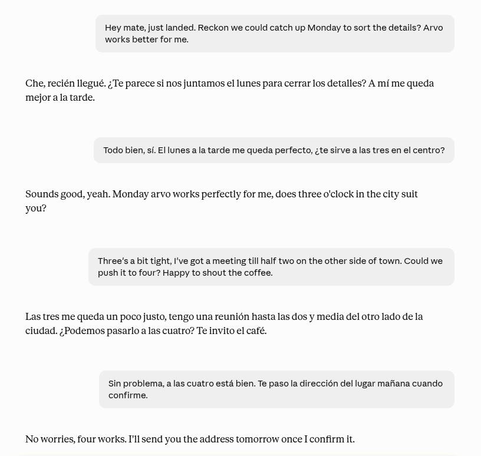
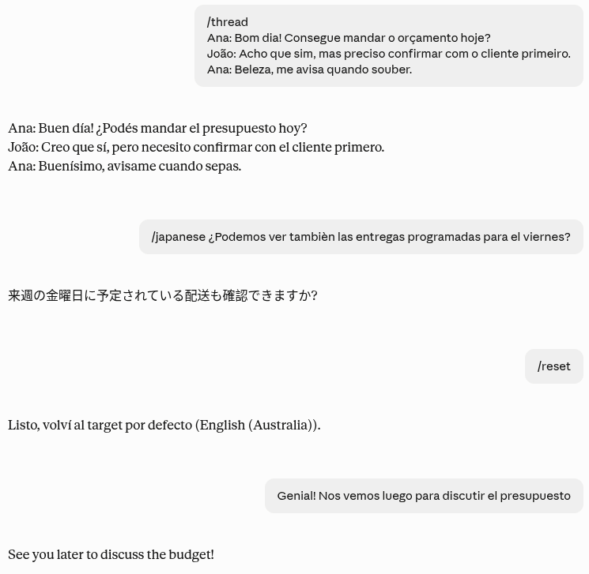

# Vaivén

**[Read in English](README.md)**

Un traductor bidireccional que vive dentro de un proyecto de Claude. Un archivo,
copiado y pegado. Sin código, sin instalar nada, sin ejecutar nada.



Toda esa conversación es un solo chat, sin tipear ningún código. Deduce para qué
lado traducir según el idioma en que está escrito cada mensaje.

## El problema que resuelve

Casi todos los prompts de traducción van en una sola dirección. Nombrás un idioma,
pegás tu texto, lo recibís traducido. Eso cubre escribir.

No cubre leer, que es la otra mitad del trabajo cuando te movés entre idiomas.
Cuando te llega un mensaje en portugués tenés que frenar y explicarle a la
herramienta qué hacer con él.

Vaivén deduce la dirección solo, pivoteando sobre tu propio idioma:

- Si algo llega en un idioma que no es el tuyo, vuelve en el tuyo.
- Si escribís en tu idioma, sale en el idioma con el que estás trabajando.

Ninguno de los dos casos te pide tipear nada extra. El nombre es justamente eso,
el movimiento de ida y vuelta.

## Cómo instalarlo

1. En Claude, creá un proyecto nuevo. Con cualquier nombre.
2. Abrí sus instrucciones.
3. Copiá todo lo que hay en [VAIVEN.md](VAIVEN.md) y pegalo ahí.
4. Completá las dos líneas marcadas REQUIRED. Borrá los corchetes junto con el
   texto de ejemplo, así después de los dos puntos queda solo tu idioma:

```
antes    I read in: [ delete this and write your language ]
después  I read in: Spanish (Argentina)

antes    I write to: [ delete this and write your language ]
después  I write to: Portuguese (Brazil)
```

5. Guardá, abrí un chat dentro de ese proyecto y escribí `/help`. Te va a decir
   qué dos idiomas tiene cargados, y así sabés que quedó bien.

Si te salteás el paso 4, Vaivén no traduce nada. Te pide los dos idiomas, en el
idioma en que le escribiste, así que una configuración a medias nunca puede mandar
tus mensajes al lugar equivocado sin avisarte.

Contestar esas preguntas vale solo para ese chat. Claude no puede editar las
instrucciones de su propio proyecto, así que te va a pasar las dos líneas ya
armadas para que las pegues vos en el paso 4. Hasta que lo hagas, cada chat nuevo
te las va a volver a preguntar.

Eso es todo. Escribí los idiomas como te salga natural. "Spanish (Mexico)",
"German", "French (Quebec)", "Brazilian Portuguese", todo funciona. Los nombres de
los idiomas van en inglés porque el motor está escrito en inglés, pero Claude te va
a responder siempre en el tuyo.

Un ajuste que conviene cambiar. En la pestaña donde uses el proyecto, desactivá el
pensamiento extendido. Traducir es una tarea directa y no lo necesita, y dejarlo
prendido le suma una demora antes de cada respuesta. El ajuste vale solo para esa
conversación y no cambia nada en el resto de tus chats de Claude.

## Cómo se usa

Las dos cosas que vas a hacer todo el día no requieren tipear nada.

| Pegás | Recibís |
|---|---|
| un mensaje en un idioma que no es el tuyo | tu idioma |
| algo que escribiste en tu idioma | tu idioma de trabajo |

Para mandar un mensaje a otro idioma, arrancá con una barra y el idioma:

```
/spanish ¿Podemos vernos el martes?
/de Gracias por el aviso.
/pt-BR Confirmo el viernes.
```

El idioma que nombrás queda activo, así que una conversación larga con una persona
te cuesta una barra al principio y nada más. `/reset` lo devuelve al original.
Recibir sigue funcionando normal, incluso con otro idioma activo.

### Nombrá el idioma como te lo acuerdes

No hace falta recordar ningún código. Todas estas formas te dan inglés
australiano:

```
/au                      el país
/en-au                   código con región, en cualquier capitalización
/australian              la variante sola
/australian-english      escrito completo
/inglés-australiano      en tu propio idioma
```

Los acentos son opcionales, las mayúsculas no importan, y un error de tipeo obvio
igual acierta. Si nombrás un país con más de un idioma principal, como Canadá, te
pregunta cuál en lugar de adivinar.

**Una trampa.** Los códigos de dos letras se leen primero como idiomas, así que
`/ar` es árabe, no Argentina. Para español rioplatense usá `/es-ar` o
`/rioplatense`. Lo mismo con `/ca`, que es catalán, y `/sv`, que es sueco. Cuando
un código de país también puede ser un idioma, escribí el país completo o agregá
la región.

Escribí `/help` dentro del proyecto cuando quieras y te recuerda todo esto.

**Una costumbre para agarrar.** Pegá el texto, no pidas nada. Si escribís
"tradúceme esto al alemán: hola", vas a recibir esa oración entera en alemán,
pedido incluido. Todo lo que mandás se trata como material, y eso es justamente lo
que hace que funcione sin prefijos. Lo que querés se dice con `/german` y el texto,
no con un pedido.

## Extras

Van pegados al idioma, o al principio del mensaje solos. Funcionan las dos formas,
la corta y la larga, usá la que te acuerdes.

| Extra | Qué hace |
|---|---|
| `+formal` | registro profesional |
| `+casual` | como escribe una persona en el celular |
| `+notes` | explica alternativas, ambigüedades y el tono real debajo |
| `+check` | te muestra literalmente qué dice la traducción, para verificarla |
| `+options` | tres versiones con registro distinto |
| `+short` | la versión más breve que siga significando lo mismo |

```
/pt+formal Gracias por el aviso, confirmo el viernes.
+check Podemos assinar na segunda?
/spanish+options Perdón, tengo que cancelar.
```

`+check` es el que vale la pena aprender. Sobre algo que estás por mandar, te
muestra en tu propio idioma qué dice literalmente tu mensaje traducido, que es la
única forma de estar seguro de algo importante en un idioma que todavía no leés
bien. Sobre algo que recibiste, te muestra el fraseo original debajo de la
traducción natural, así ves cómo estaba armada la oración.


Las notas y los chequeos siempre vuelven en tu idioma, nunca en el destino. Son
para vos, no para quien recibe el mensaje.

## Comandos

| Comando | Qué hace |
|---|---|
| `/help` | machete, más tu configuración actual |
| `/all` | tu idioma, tu idioma de trabajo y el inglés a la vez |
| `/polish` | este texto es un borrador tuyo, corregilo y pulilo |
| `/thread` | una conversación entre varias personas, o una captura |
| `/ask` | esto sí es una consulta sobre idioma, respondela |
| `/reset` | volver al idioma de tu configuración |

`/polish` necesita el comando. Sin él, cualquier cosa que pegues en tu idioma de
trabajo se asume que es algo que recibiste, porque es lo que es casi siempre.

`/thread` es la sorpresa útil. Pegá un log de chat entero, o tirá una captura de
pantalla, y vuelve cada mensaje traducido en orden, con quién habló y los horarios
intactos.



Arriba hay tres cosas seguidas: una conversación pegada, un mensaje mandado a otro
idioma, y `/reset` devolviendo el destino al original. Cualquiera de estos puede
llevar texto en el mismo mensaje.

## Fotos

Mandá una foto en lugar de texto y lee lo que esté escrito ahí, después te devuelve
la traducción sin describirte la imagen. Menús, carteles en la calle, formularios,
cartas, etiquetas de productos. Sirve cuando estás parado en algún lugar y
necesitás saber qué dice algo.


La estructura se mantiene, así que un menú vuelve como menú y no como un párrafo.

Si es una captura de una conversación, usá `/thread` para que mantenga separado a
cada uno.

## Dos cosas que evitan que falle

**Los códigos llevan barra.** La escritura común nunca arranca con una, así que un
mensaje que empieza con una palabra corta nunca se confunde con un código de
idioma. Si alguna vez necesitás estar seguro, empezá el mensaje con dos guiones y
se traduce literal, con lo que sea que contenga.

**Ante duda, traduce.** Equivocarse hacia traducir deja un `/algo` visible en la
salida, que se detecta y se arregla en un segundo. Equivocarse al revés se come una
palabra en silencio y elige el idioma equivocado. Esos dos errores no salen igual
de baratos, así que siempre se equivoca para el mismo lado.

## Qué esperar

Es bueno en lo que la traducción automática suele ser peor: registro, tono,
modismo, y sonar como una persona en lugar de un manual. Reescribe fechas,
separadores decimales y unidades para el idioma destino en vez de copiar el
original.

No está hecho para documentos. Para un PDF largo o un libro, usá una herramienta
pensada para eso. Vaivén es para el mensaje, el mail, el hilo y la captura.

Todo lo que hace sale de instrucciones y no de código real, así que sigue las
reglas de forma confiable pero no con certeza mecánica. `+check` existe para los
momentos en que estar seguro importa más que ir rápido.

## Hacerlo tuyo

Dos secciones opcionales al final de la configuración, las dos en lenguaje común:

**Never translate.** Nombres de marcas, productos, jerga interna. Todo lo que
quieras que quede exactamente como está escrito.

**Extra notes.** Cómo querés que suenen tus traducciones, en oraciones normales.
"Mis mails cortos y directos." "Mi portugués es para amigos, no para trabajo."
"Nunca uses guiones largos." Todo lo que le dirías a un traductor humano, lo podés
escribir acá.

## Licencia

MIT. Forkealo, reescribí la configuración, cambiale los comandos, cambiale el
nombre.

---

Hecho por [Not Nulled Labs](https://www.notnulled.com) y liberado gratis para
que lo use cualquiera en el mundo.
