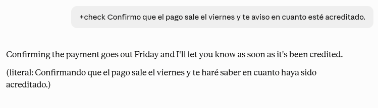
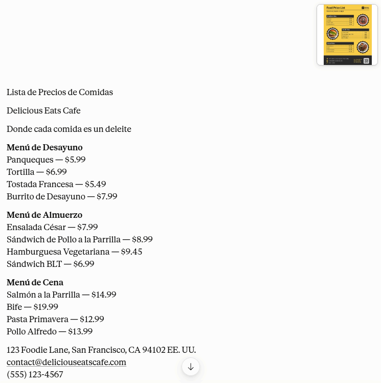

# Vaivén

**[Leer en español](README.es.md)**

A two-way translator that lives inside a Claude project. One file, copied and
pasted. No code, nothing to install, nothing to run.


The whole conversation above, in one chat, with no codes typed. It works out which
way to translate from the language each message is written in.

## The problem it solves

Most translation prompts only go one way. You name a language, you paste your
text, you get it back translated. That covers writing.

It does not cover reading, which is the other half of working across languages.
When a message arrives in Portuguese you have to stop and tell the tool what to
do with it.

Vaivén works out the direction on its own, by pivoting on your own language:

- Something arrives in a language that is not yours, it comes back in yours.
- You write in your language, it goes out in the language you are working in.

Neither case needs you to type anything extra. The name is Spanish for a back and
forth motion, which is the whole idea.

## Setting it up

1. In Claude, create a new Project. Any name.
2. Open its instructions.
3. Copy everything in [VAIVEN.md](VAIVEN.md) and paste it there.
4. Fill in the two lines marked REQUIRED. Delete the brackets along with the
   placeholder text, so only your language is left after the colon:

```
before   I read in: [ delete this and write your language ]
after    I read in: Hindi

before   I write to: [ delete this and write your language ]
after    I write to: English (India)
```

5. Save, open a chat inside that project, and type `/help`. It will tell you
   which two languages it has, which is how you know it worked.

If you skip step 4, Vaivén will not translate anything. It will ask you for the
two languages instead, in whatever language you wrote to it in, so a half finished
setup can never quietly send your messages to the wrong place.

Answering those questions only holds for that one chat. Claude cannot edit its own
project instructions, so it will hand you the two finished lines to paste into
step 4 yourself. Until you do, every new chat will ask again.

That is all of it. Write the languages however feels natural. "Spanish (Mexico)",
"German", "French (Quebec)", "Brazilian Portuguese" all work.

One setting worth changing. In the chat where you use the project, turn extended
thinking off. Translating is a direct task and does not need it, and leaving it on
adds a delay before every reply. The setting applies to that chat only and changes
nothing about your other conversations in Claude.

## Using it

The two things you will do all day need no typing at all.

| You paste | You get back |
|---|---|
| a message in a language that is not yours | your language |
| something you wrote in your language | your working language |

To send one message somewhere else, start it with a slash and the language:

```
/spanish Can we meet on Tuesday?
/de Thanks for the update.
/pt-BR I will confirm on Friday.
```

The language you name sticks around, so a long back and forth with one person
costs you one slash at the beginning and nothing after that. `/reset` puts it
back. Receiving always works normally, even with another language active.

### Naming the language however you remember it

You do not have to recall a code. All of these get you Australian English:

```
/au                      the country
/en-au                   code with a region, any capitalisation
/australian              the variant on its own
/australian-english      spelled out
/inglés-australiano      in your own language
```

Accents are optional, capitals do not matter, and an obvious typo still lands.
If you name a country with more than one main language, like Canada, it will ask
which one instead of guessing.

**One trap.** Two letter codes are read as languages first, so `/ar` is Arabic,
not Argentina. For Argentine Spanish use `/es-ar` or `/rioplatense`. Same idea
with `/ca`, which is Catalan, and `/sv`, which is Swedish. When a country code
could also be a language, spell the country out or add the region.

Type `/help` inside the project any time and it will remind you of all of this.

**One habit to build.** Paste the text, do not ask for anything. If you write
"translate this into German: hello", you will get that entire sentence in German,
question included. Everything you send is treated as material, which is exactly
what makes it work without prefixes. Say what you want with `/german` and the
text, not with a request.

## Extras

Add these right after the language, or at the start of the message on their own.
Short and long forms both work, use whichever you remember.

| Extra | What it does |
|---|---|
| `+formal` | professional register |
| `+casual` | how a person actually texts |
| `+notes` | explains alternatives, ambiguities and the real tone underneath |
| `+check` | shows you literally what the translation says, to verify it |
| `+options` | three versions in different registers |
| `+short` | the shortest version that still means the same thing |

```
/pt+formal Thanks for the update, I will confirm by Friday.
+check Podemos assinar na segunda?
/spanish+options Sorry, I have to cancel.
```

`+check` is the one worth learning. On something you are about to send, it shows
you in your own language what your translated message literally says, which is the
only way to be sure about something important in a language you cannot read well
yet. On something you received, it shows the original phrasing underneath the
natural translation, so you can see how the sentence was actually built.



Notes and checks always come back in your language, never in the target. They are
for you, not for the person receiving the message.

## Commands

| Command | What it does |
|---|---|
| `/help` | cheat sheet, plus your current setup |
| `/all` | your language, your working language and English at once |
| `/polish` | this text is your own draft, fix and smooth it |
| `/thread` | a conversation between several people, or a screenshot |
| `/ask` | this one really is a question about language, answer it |
| `/reset` | back to the language in your setup |

`/polish` needs the command. Without it, anything you paste in your working
language is assumed to be something you received, because that is what it almost
always is.

`/thread` is the useful surprise. Paste an entire chat log, or drop in a
screenshot of one, and every message comes back translated in order with the
speakers and times intact.


Three things in a row above: a pasted conversation, a single message sent somewhere
else, and `/reset` bringing the target back. Any of these can carry text in the
same message.

## Photos

Send a photo instead of text and it reads whatever is written in it, then hands
back the translation with no description of the picture. Menus, street signs,
forms, letters, labels on packaging. Useful when you are standing somewhere and
need to know what something says.



Structure survives, so a menu comes back as a menu rather than a paragraph.

For a screenshot of a conversation, use `/thread` so the speakers are kept
separate.

## Two things that keep it from misfiring

**Codes need a slash.** Ordinary writing never begins with one, so a message that
happens to start with a short word is never mistaken for a language code. If you
ever need to be certain, begin the message with two dashes and it will be
translated literally, whatever it contains.

**When unsure, it translates.** A wrong guess toward translating leaves a stray
`/something` visible in the output, which takes a second to spot and fix. A wrong
guess the other way silently swallows a word and picks the wrong language. Those
two mistakes are not equally cheap, so it always errs the same way.

## What to expect

It is good at the things machine translation is usually worst at: register, tone,
idiom, and sounding like a person rather than a manual. It rewrites dates, decimal
separators and units to suit the target language instead of copying the original.

It is not built for documents. For a long PDF or a book, use a tool made for
that. Vaivén is for the message, the email, the thread and the screenshot.

Everything it does comes from instructions rather than actual code, so it follows
the rules reliably but not with mechanical certainty. `+check` exists for the
moments when being sure matters more than being quick.

## Making it yours

Two optional sections at the bottom of the setup, both plain language:

**Never translate.** Brand names, products, internal jargon. Anything you want
left exactly as written.

**Extra notes.** How you want your translations to sound, in ordinary sentences.
"Keep my emails short and direct." "My Portuguese is for friends, not work."
"Never use dashes." Anything you would tell a human translator, you can write
here.

## Licence

MIT. Fork it, rewrite the setup, rename the commands, rename the whole thing.

---

Built by [Not Nulled Labs](https://www.notnulled.com) and released free for
anyone in the world to use.
